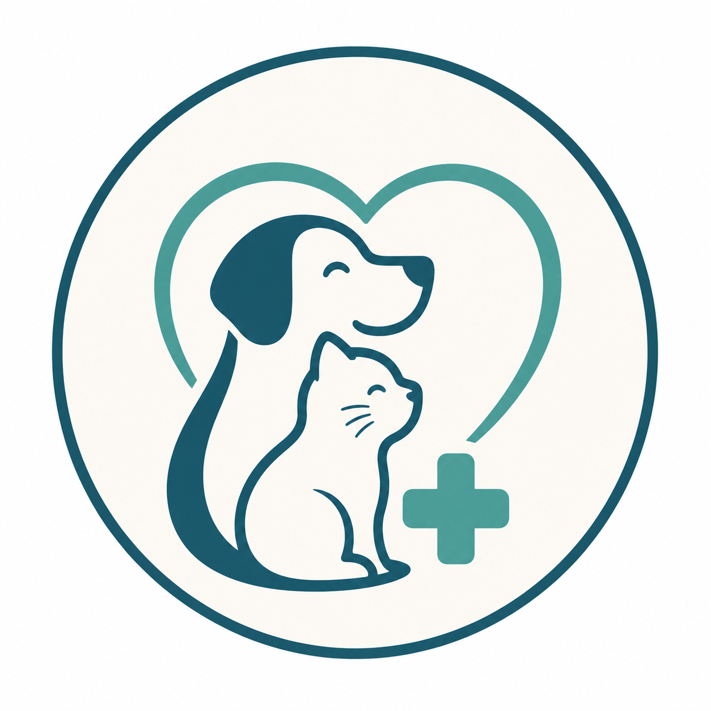
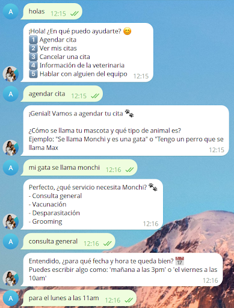
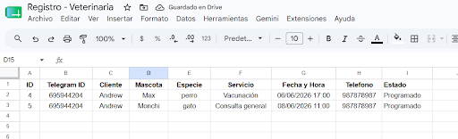
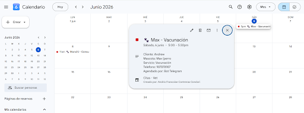
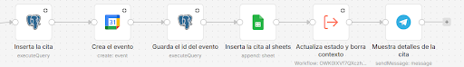

<h1 align="center"> 🐾 Vitalvet - Asistente Virtual Inteligente 🏥 </h1>

<p align="center">
  
</p>

<p align="center">
   &nbsp;
   &nbsp; 
   &nbsp; 
   &nbsp;
   &nbsp;
</p>

---

## 📝 Descripción del Proyecto

Vitalvet es un sistema automatizado de gestión de citas diseñado para clínicas veterinarias. A diferencia de los chatbots tradicionales basados en comandos fijos, este asistente opera en Telegram e integra modelos de lenguaje (LLM) para interpretar las intenciones del usuario mediante lenguaje natural. 

Orquestado íntegramente en n8n, el sistema maneja la persistencia de estados conversacionales y sincroniza las reservas en tiempo real con bases de datos y herramientas de ofimática, brindando una experiencia "fricción cero" tanto para el cliente como para la administración médica.

Este proyecto fue desarrollado para el curso de **Innovación y Transformación Digital**.

---

## 🛠️ Tecnologías utilizadas

- **n8n:** Motor central de orquestación y flujos de trabajo.
- **Telegram API:** Frontend conversacional mediante Webhooks.
- **Groq API (Llama 4):** Inferencia de Inteligencia Artificial de ultra baja latencia.
- **PostgreSQL / Supabase:** Persistencia transaccional de usuarios, citas y contexto JSONB.
- **Google Calendar API:** Generación y gestión de eventos de la agenda médica.
- **Google Sheets API:** Repositorio histórico y de auditoría visual.

---

## 🚀 Características Principales

- **Comprensión Semántica:** El sistema clasifica intenciones y extrae entidades (mascota, servicio, fecha) a partir de mensajes coloquiales, forzando salidas en JSON estricto.
- **Gestión de Estados:** Implementación de una máquina de estados para evitar colisiones de contexto y guiar al usuario a través del embudo de agendamiento.
- **Transaccionalidad Sincronizada:** Creación concurrente de registros en PostgreSQL, Google Calendar y Google Sheets.
- **Manejo de Errores Inteligente:** Validaciones Regex para formatos de teléfono peruanos y fallbacks ante fechas pasadas o consultas fuera de horario.
- **Notificaciones al Equipo:** Alertas dinámicas con enlaces de chat directo a Telegram en caso de requerir soporte humano especializado.

---

## 🤖 Flujos Conversacionales

### Agendamiento (Ruta Principal):
1. Captura de intención y solicitud de número telefónico (si es usuario nuevo).
2. Extracción de nombre de la mascota y tipo de servicio (ej. "Vacunación").
3. Evaluación de fechas mediante funciones temporales dinámicas.
4. Confirmación, guardado en base de datos e inyección del evento en Google Calendar.

### Cancelación y Soporte:
- El usuario puede solicitar la cancelación de su cita; el bot recupera el `calendar_event_id` y libera el espacio automáticamente.
- Funciones de consulta de horarios e información general de la clínica sin intervención humana.

---

## 📸 Capturas del Sistema

<details>
  <summary>Ver demostración en Telegram</summary>
  
</details>

<details>
  <summary>Registro en Google Sheets y Calendar</summary>
  
  
</details>

<details>
  <summary>Flujo de Nodos en n8n</summary>
  
</details>


---

## ▶️ Instalación y Ejecución Local

Para replicar este entorno de forma local, sigue estos pasos:

1. **Clonar el repositorio:**
```bash
   git clone https://github.com/DranxFa/chatbot-booking-n8n-ia-telegram.git
```
2. **Configurar la Base de Datos:**
   - Ejecuta el script provisto en la carpeta `database/schema.sql` en tu entorno de PostgreSQL o Supabase para generar las tablas `usuarios` y `citas`.

3. **Importar Flujos en n8n:**
   - Abre tu instancia de n8n.
   - Ve a *Workflows* > *Import from File* y selecciona los archivos `.json` de este repositorio.

4. **Configurar Credenciales:**
   - Dentro de n8n, dirígete a *Credentials* y vincula tus propios accesos para:
     - Telegram Bot API
     - Groq API
     - PostgreSQL
     - Google OAuth2 (Calendar y Sheets)

5. **Activar el Bot:**
   - Enciende el webhook en el flujo principal de n8n y envía un mensaje a tu bot en Telegram.

---

## 📂 Estructura del Repositorio

- `workflows/`: Archivos JSON con los diagramas completos importables a n8n.
- `database/`: Scripts SQL para replicar el modelo Entidad-Relación y triggers.
- `assets/`: Imágenes, esquemas arquitectónicos y diagramas del flujo.

---

## 👤 Autor

| [<br><sub>Andrio Contreras</sub>](https://github.com/DranxFa) |
| :---: |

---

## 📌 Estado del Proyecto

✅ **Finalizado** — MVP funcional abierto a mejoras o nuevas versiones.
